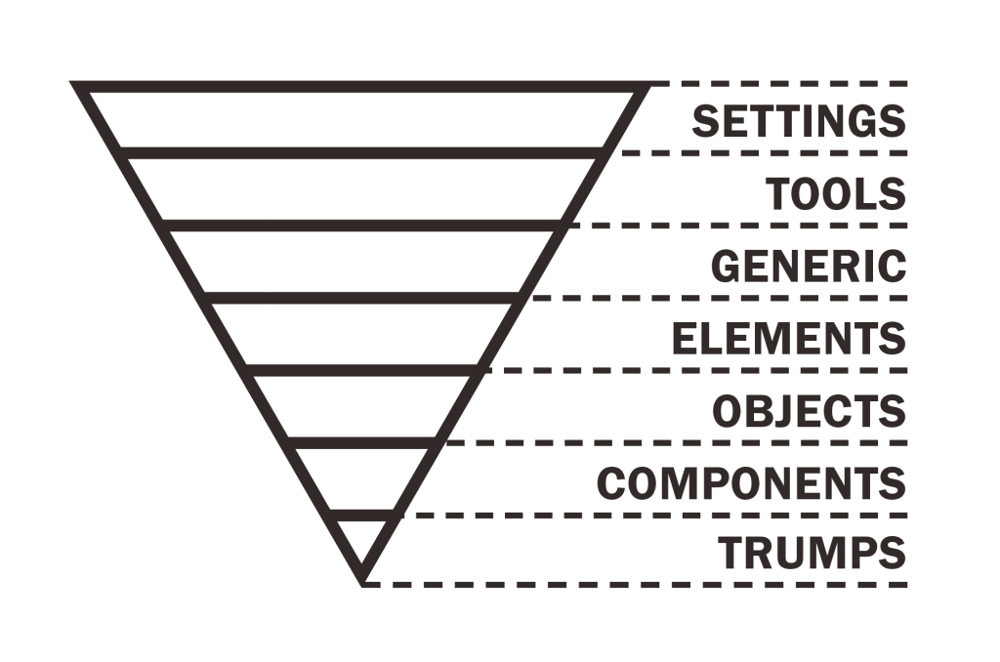

# blepbemit 🎨

This is a boilerplate for using SCSS with [BEMIT](#bemit). 

That is a combination of the naming convention [BEM](#bem) and the [ITCSS](#itcss) architecture.

## BEM

BEM is a naming convention that makes the CSS easier to read and understand. It makes it easier to scale and generally more easy to work with. BEM is an abbreviation of the structure of the methodology. The elements of the structure is **B**lock, **E**lement and **M**odifier. The examples are tied to the ITCSS architecture.

### Block

This is a standalone entity that has its own meaning and purpose. The block is `.c-button`.

```scss
.c-button {
    display: inline-block;
    padding: 1em;
}
```

### Element

This should be a part of a block that has no standalone meaning and purpose. It should be semantically tied to its block. The element is `&__text`.

```scss
.c-button {
    display: inline-block;
    padding: 1em;
    
    &__text {
        font-size: 1em;
        font-weight: 400;
    }
}
```

### Modifier

This should be a flag on a block or an element. Here we are able to change appearance or behavior. The modifier is `&--bold`.

```scss
.c-button {
    display: inline-block;
    padding: 1em;
    
    &__text {
        font-size: 1em;
        font-weight: 400;
        
        &--bold {
            font-weight: 700;
        }
    }
}
```

One of the most important rules is, that you can't have an element inside an element and you can't have a modifier inside a modifier.

## ITCSS

ITCSS stands for **I**nverted **T**riangle **CSS** and is an architecture that helps you to organize your project CSS files. 



It is important not to output any CSS in the first 2 layers. These are the layers:
- **Settings**: It contains variables and maps for fonts, colors and so on.
- **Tools**: It is mostly used for mixins and functions. 
- **Generic**: Here we have reset, normalize, box-sizing definition  and so on.
- **Elements**: This is styling for HTML elements like `<h1>` and ``. We want to define them here to overwrite the browser styling.
- **Objects**: This is used for class-based selectors focused around design patterns. This might be layout or grid.
- **Components**: It is here most of the styling would take place. This is UI components like buttons or the menu.
- **Trumps**: Here we are able to overwrite anything before this layer.

## BEMIT

This is when you are combining **BEM** and **IT**CSS. The examples above has the naming convention implemented. Settings, tools, generic and elements does not include class selectors. These are the one we use: **Objects**: `o-`, **Components**: `c-` and **Trumps**: `u-`. On trumps we use `u-` because it is also called utilities.
